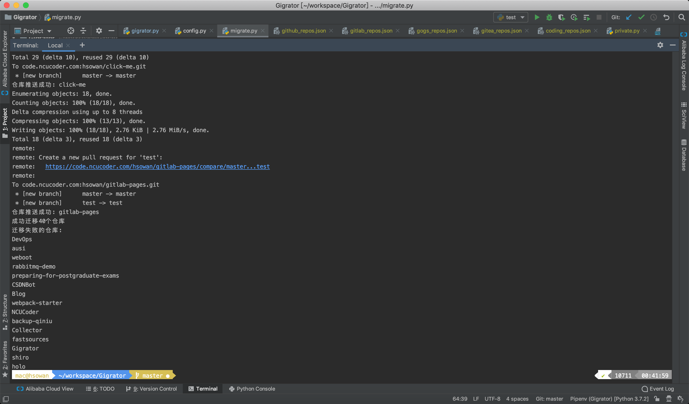

# Gigrator

en | [zh](./README_zh.md)

Migrate repos from one GitServer to another.



## Todo

* [ ] **[ADMIN]Migrate all repos on a GitServer**

## Support

* [x] [Gitee](https://gitee.com/)
* [x] [GitLab](https://gitlab.com/)
* [x] [GitHub](https://github.com/)
* [x] [Gitea](https://gitea.io/zh-cn/)
* [x] [Coding](https://coding.net/)
* [x] [Gogs](https://gogs.io/)

Note:
* **`Coding` only support migrating out**
* Make sure you have added `SSH Key` on GitServers before using
* Only support migrating repos the specified user owned and repo path like `:username/:repo`, not include repos participated in or belonged to groups
* Migration includes all commits, branches and tags, not include issues, pr and wiki
* Factors affecting migration speed: GitServer bandwidth and local network speed

## Environment

* Git
* Python

My own development environment: `git version 2.20.1 (Apple Git-117)` + `Python 3.7.2`

## Dependency

* [Requests](https://2.python-requests.org/en/master/)

## Config

[config.py](./config.py)

## Start

```shell script
# Install pipenv
pip install --user pipenv

# Clone the repo
git clone git@github.com:hsowan/Gigrator.git
cd gigrator

# Init venv
pipenv --python 3
pipenv install

# Run
pipenv run python gigrator.py

```

## Flow

1. Provide the source and the dest GitServers for migration
2. List all repo on the source GitServer
3. Input repos to migrate
4. Migrate the selected repos:
    1. Inspect that the dest GitServer has a repository of the same name
    2. Clone repo from the source GitServer
    3. Create repo on the dest GitServer
    4. Push repo to the dest GitServer
    
## Wish

Expect **Issues/PR** :pray:

## Docs

### GitLab

* [GitLab API](https://docs.gitlab.com/ee/api/)
* [GitLab Create Repo](https://docs.gitlab.com/ee/api/projects.html#create-project)
* [Project visibility level](https://docs.gitlab.com/ee/api/projects.html#project-visibility-level)

### GitHub

* [GitHub API v3](https://developer.github.com/v3/)
* [GitHub Create Repo](https://developer.github.com/v3/repos/#create)
* [GitHub Personal Access Token](https://github.com/settings/tokens)

### Gitee

* [Gitee OpenAPI](https://gitee.com/api/v5/swagger#/getV5ReposOwnerRepoStargazers?ex=no)
* [Gitee Personal Access Token](https://gitee.com/profile/personal_access_tokens)

### Gitea

* [Gitea API](https://gitea.com/api/v1/swagger)
* [Get a repo](https://gitea.com/api/v1/swagger#/repository/repoGet)
* [Create a repo](https://gitea.com/api/v1/swagger#/repository/createCurrentUserRepo)
* [List the repos that the authenticated user owns or has access to](https://gitea.com/api/v1/swagger#/user/userCurrentListRepos)

### Gogs

* [gogs/docs-api](https://github.com/gogs/docs-api)

### Coding

* [Open API](https://open.coding.net/open-api/?_ga=2.122224323.99121124.1563808661-1235584671.1544277191)

## License

[MIT](https://github.com/hsowan/Gigrator/blob/master/LICENSE)

