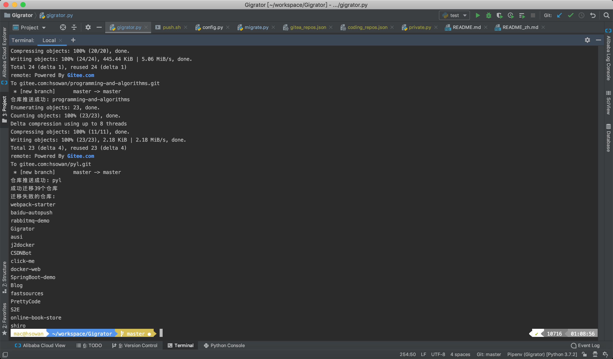

# Gigrator

[](https://github.com/k8scat/gigrator)
[](https://gitee.com/k8scat/gigrator)

Git 代码仓批量迁移



## Start

```shell script
git clone https://github.com/k8scat/gigrator.git
cd gigrator
pip3 install -r requirements.txt

# 迁移前需在配置文件(settings.py)中配置 SOURCE_GIT 和 DEST_GIT
# 配置参考: settings_example.py
python3 gigrator.py
```

## Develop

```python
# Base class
class Git:
    pass

# Other GitServer class should inherit Git
class OtherGit(Git):
    pass
```

## Support

* [x] [Gitee](https://gitee.com/)
* [x] [GitLab](https://gitlab.com/)
* [x] [GitHub](https://github.com/)
* [x] [Gitea](https://gitea.io/zh-cn/)
* [x] [Coding](https://coding.net/)
* [x] [Gogs](https://gogs.io/)
* [x] [腾讯工蜂](https://code.tencent.com/)
* [ ] [Bitbucket](https://bitbucket.org/)

Note:

* 不支持迁移至 `Coding`, 可从 Coding 迁移至其他 `Git` 服务器
* 由于 `Coding` 的升级, 其基础 `API` 不再是 `https://coding.net`, 而改为: `https://{username}.coding.net`
* 迁移前请确认已在Git服务器上添加 `SSH Key`
* 只能迁移指定用户下的仓库, 即 `{username}/{repo_name}`, 不包括参与的或者组织的仓库
* 迁移包括commits、branches和tags, 不包括issues、pr和wiki

## Environment

* Git
* Python

开发环境: `git version 2.20.1 (Apple Git-117)` + `Python 3.7.2`

## Dependencies

* [Requests](https://2.python-requests.org/en/master/)

## References

### GitLab

* [GitLab API Docs](https://docs.gitlab.com/ee/api/)
* [GitLab Create Repo](https://docs.gitlab.com/ee/api/projects.html#create-project)
* [Project visibility level](https://docs.gitlab.com/ee/api/projects.html#project-visibility-level)

## [GitLab GraphQL API](https://docs.gitlab.com/ee/api/graphql/)

Can not create a project!

It will co-exist with the current v4 REST API. If we have a v5 API, this should be a compatibility layer on top of GraphQL.

* [Introduction to GraphQL](https://developer.github.com/v4/guides/intro-to-graphql/)
* [GraphQL API Resources](https://docs.gitlab.com/ee/api/graphql/reference/index.html)

### [GitHub REST API v3](https://developer.github.com/v3/)

* [GitHub Create Repo](https://developer.github.com/v3/repos/#create)
* [GitHub Personal Access Token](https://github.com/settings/tokens)

## [GitHub GraphQL API v4](https://developer.github.com/v4/)

* [GraphQL resource limitations](https://developer.github.com/v4/guides/resource-limitations/)
* [Forming Calls with GraphQL](https://developer.github.com/v4/guides/forming-calls/)


### Gitee

* [Gitee OpenAPI](https://gitee.com/api/v5/swagger#/getV5ReposOwnerRepoStargazers?ex=no)
* [Gitee Personal Access Token](https://gitee.com/profile/personal_access_tokens)

### Gitea

* [Gitea API](https://gitea.com/api/v1/swagger)
* [Get a repo](https://gitea.com/api/v1/swagger#/repository/repoGet)
* [Create a repo](https://gitea.com/api/v1/swagger#/repository/createCurrentUserRepo)
* [List the repos that the authenticated user owns or has access to](https://gitea.com/api/v1/swagger#/user/userCurrentListRepos)

### Gogs

* [gogs/docs-api](https://github.com/gogs/docs-api)
* [Demo site](https://try.gogs.io/)

### Coding

* [Open API](https://help.coding.net/openapi)

### GF (腾讯工蜂)

* [Open API](https://code.tencent.com/help/api/prepare)

### GraphQL Client

* [sgqlc](https://github.com/profusion/sgqlc)

## License

[MIT](https://github.com/k8scat/gigrator/blob/master/LICENSE)
